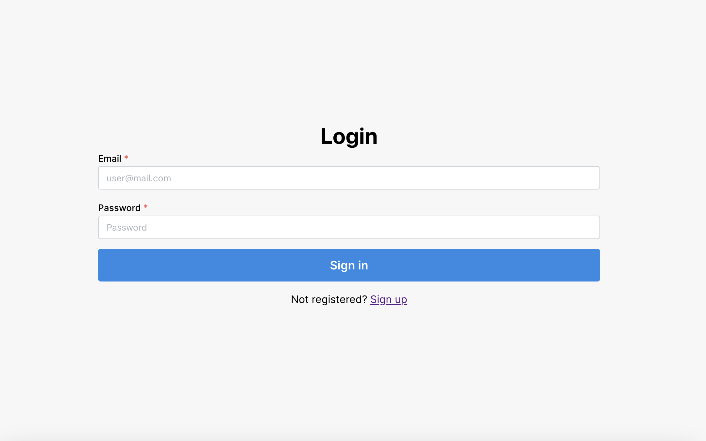
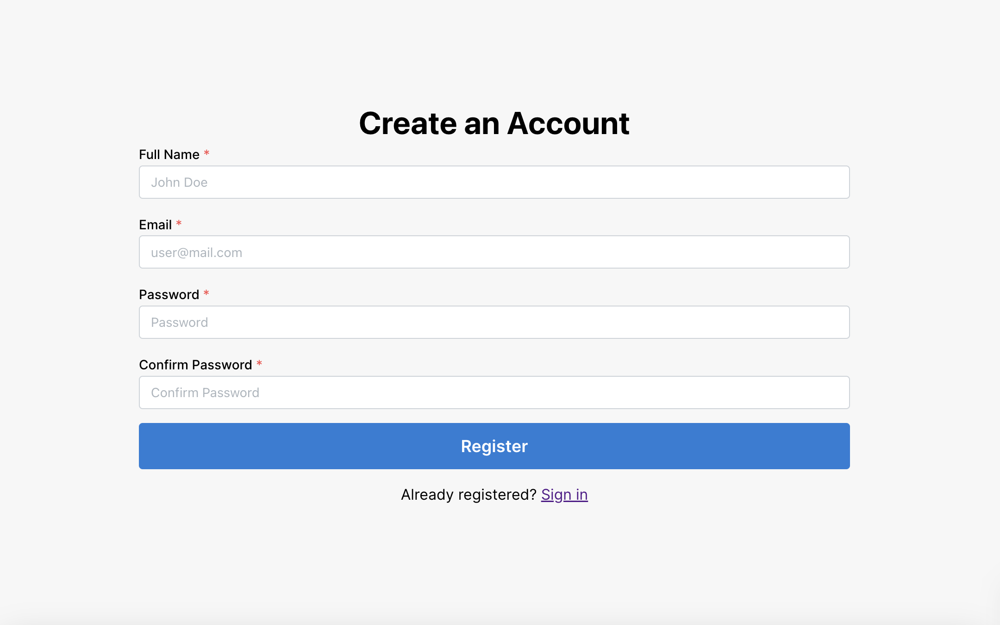
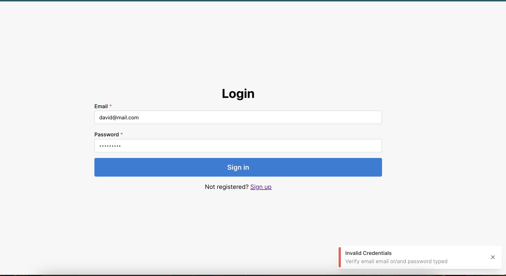
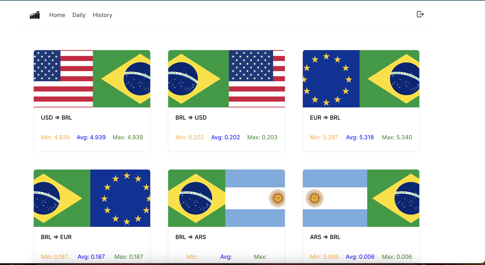
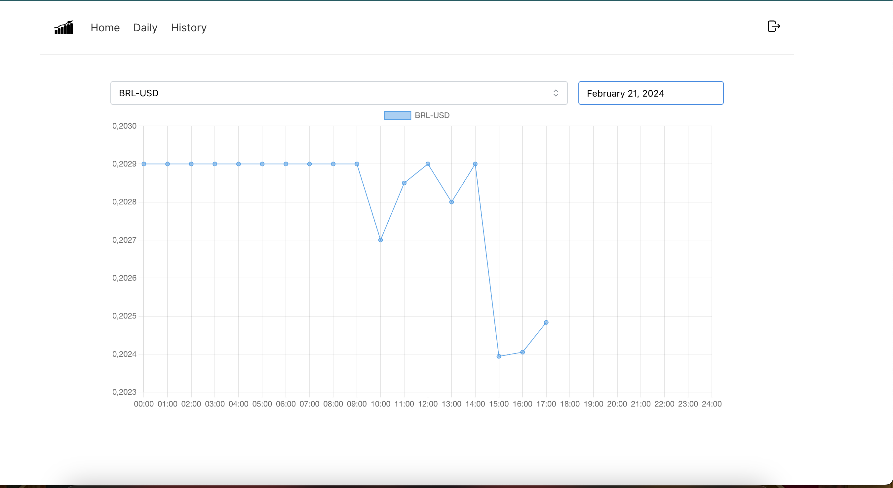
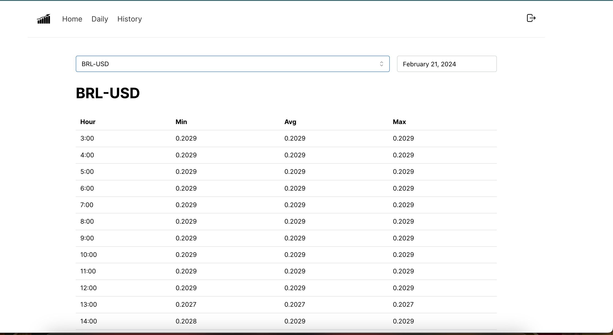
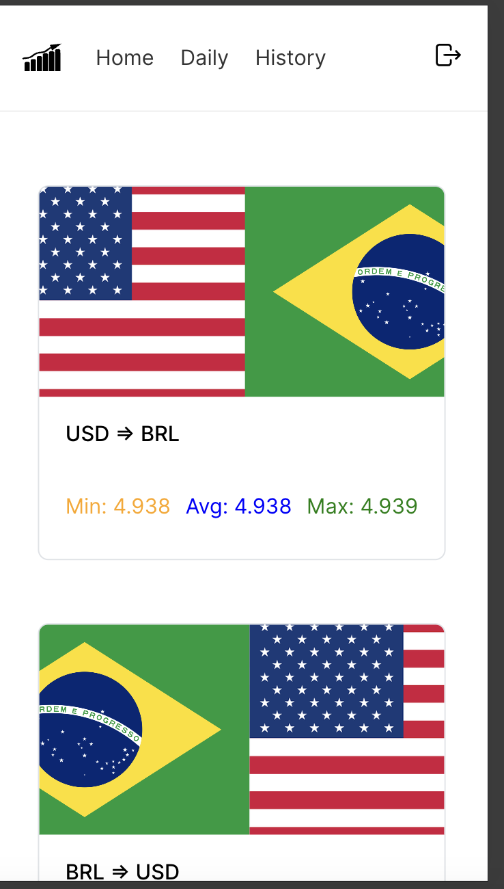
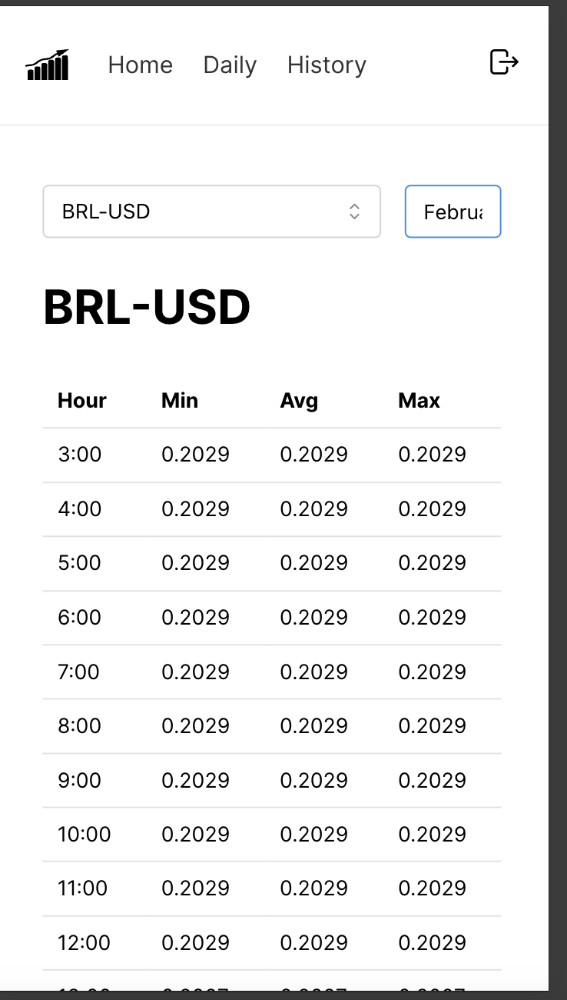

# Projeto frontend

## Características Gerais
- Implementado com next.js com typescript
- Para interface foi utilizado mantine-ui, sem qualquer dependência de outro framework ou lib, apenas css em algumas situações. Layout, input, tabela e notificação todos foram utilizando a biblioteca do mantine-ui
- Para os gráficos, foi utilizado o chart.js
- Por causa do prazo, foi implementado apenas teste e2e com cypress nas páginas de login e registro
- Pela falta de conhecimento no framework, não utilizei autenticação para as páginas, apenas defini o token no localStorage. Poderia ter feito uma gambiarra para pegar mas achei incoventiente
- No desafio era necessário somente conversão dolar para real, mas preferi ir além e colocar várias conversões, que trazem somente em uma response na API, nada de chamar várias vezes com parâmetros diferentes para cada conversão

## Características arquiteturais
- Como tenho conhecimento no frontend mais aplicado ao Angular, decidi 'copiar' a estrutura para o next.js. Então foi definido dois contextos que são na verdade providers, e a partir disso foi realizado o manuseamento de estado e requests
- Os componentes foram criados de maneira genérica, passando propriedades para tais. Como não conheco muito o ambiente react e next.js, espero ter seguido as boas práticas

## Observações
- Não foram feitos tratamentos de erros, ou seja, dependendendo da falta de dados, não irá aparecer nada na tela por questão de não ter tratado isso
- Os testes do cypress foram feitos utilizados mocks, o que garante melhor tratamento aos possíveis erros de API

## Execução do app
- Só executar o comando `npm run dev` e acessar a url 'http://localhost:3000/login'
- OBS: Lembrar de executar API junto

## Execução dos testes e2e
- Só executar o comando `npm run cypress:open` e escolher os testes
- OBS: Lembrar de executar o app junsto

## Imagens

